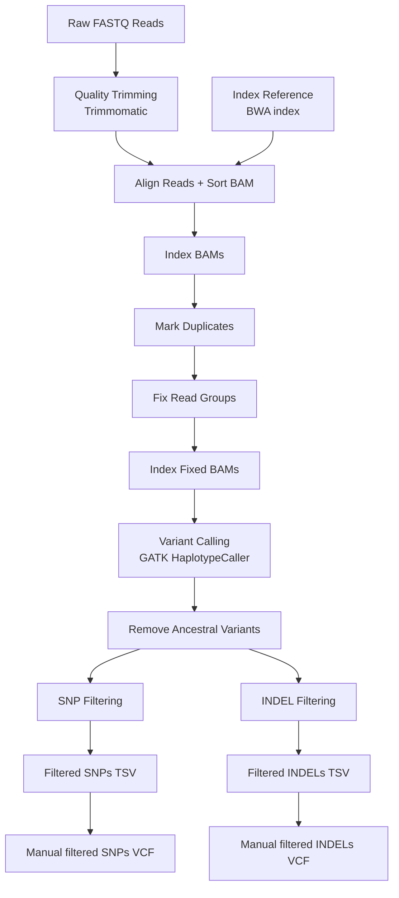

# Genomic Variant Calling Pipeline

**Genomics · Python · GATK**

From raw reads to **filtered variants**

A generalizable end-to-end pipeline that takes paired-end FASTQ files from any organism and any reference genome through quality control, alignment, duplicate marking, variant calling, and multi-stage filtering—down to a clean SNP and INDEL table.

---

## Table of Contents

- [Overview](#overview)
- [Pipeline Workflow](#pipeline-workflow)
- [Requirements](#requirements)
- [Pipeline Steps](#pipeline-steps)
- [Usage](#usage)
- [Script](#script)

---

## Overview

This pipeline wraps nine sequential stages—from raw Illumina paired-end reads all the way to filtered, repeat-region-aware SNP and INDEL tables—into a single Python script.

Every path, ploidy, thread count, and ancestor VCF set is configurable from the command line, making it portable across projects and organisms.

---

## Pipeline Workflow



---

## Requirements

| Tool | Purpose |
|--------|--------|
| Python ≥ 3.10 | Pipeline driver |
| Trimmomatic | Read quality trimming |
| BWA | Genome alignment |
| Picard | SAM/BAM processing |
| samtools | BAM indexing |
| GATK 4 | Variant calling & filtering |
| bcftools | Ancestor subtraction |
| bgzip / tabix | VCF compression & indexing |

---

## Pipeline Steps

### 1. Quality Trimming

**Tool:** Trimmomatic

- Removes adapters and low-quality bases.
- Sliding-window trimming (4 bp window, Q20).
- Discards reads shorter than 36 bp.
- Configurable via:

```bash
--minlen
--headcrop
```

---

### 2. Index Reference Genome

**Tool:** BWA

Builds the BWT/SA index required for alignment.

```bash
bwa index -a bwtsw reference.fa
```

Optional:

```bash
--skip-index
```

---

### 3. Align Reads and Sort BAM

**Tools:** BWA MEM + Picard SortSam

- Align paired-end reads.
- Convert SAM → coordinate-sorted BAM.
- Remove intermediate SAM files.

---

### 4. Index Sorted BAMs

**Tool:** Picard BuildBamIndex

Creates:

```text
sample_sorted.bam.bai
```

Required for downstream GATK processing.

---

### 5. Mark Duplicates

**Tool:** Picard MarkDuplicates

- Identifies PCR and optical duplicates.
- Generates duplication metrics.
- Duplicate reads remain flagged, not removed.

---

### 6. Fix Read Groups

**Tool:** Picard AddOrReplaceReadGroups

Adds:

```text
RGID
RGLB
RGPL
RGPU
RGSM
```

required by GATK.

---

### 7. Index Fixed BAMs

**Tool:** samtools index

Creates a fresh BAM index after read-group modification.

---

### 8. Variant Calling

**Tool:** GATK HaplotypeCaller

Configurable ploidy:

```bash
--ploidy 2
```

Annotations added:

- FisherStrand (FS)
- StrandOddsRatio (SOR)
- AlleleFraction (AF)

Outputs:

```text
sample.vcf.gz
sample.vcf.gz.tbi
```

---

### 9. Mutation Filtering

#### Stage A: Remove Ancestral Variants

```bash
bcftools isec
```

Subtracts variants found in one or more ancestor VCFs.

#### Stage B: Separate SNPs and INDELs

```bash
gatk SelectVariants
```

#### Stage C: Hard Filtering

SNP filters:

```text
QD < 2
DP < 10
SOR > 3
FS > 60
MQ < 50
```

INDEL filters:

```text
QD < 2
DP < 10
FS > 200
MQ < 50
```

#### Stage D: Repeat-Based Filtering

- SNPs in repeat regions with repeat count ≥10 flagged as false positives.
- INDELs inside repeat regions flagged as false positives.

#### Stage E: Repeat-Based Filtering

- Final step of filtering SNPs by eyeballing in IGV.
- Final step of filtering INDELs by eyeballing in IGV.
```
---

## Usage

### Basic Run

```bash
python genomic_variant_pipeline.py \
    --project-dir project \
    --ref reference.fa \
    --ancestor-vcf ancestor1.vcf.gz \
    --ancestor-vcf ancestor2.vcf.gz \
    --ploidy 2 \
    --threads 16
```

### Resume Pipeline

```bash
python genomic_variant_pipeline.py \
    --start-step 5
```

### Skip Reference Indexing

```bash
python genomic_variant_pipeline.py \
    --skip-index
```

---

## Script

```python
#!/usr/bin/env python3

"""
Genomic Variant Calling Pipeline

End-to-end pipeline:
raw FASTQ → filtered SNP/INDEL tables
"""
```

Place the full script in:

```text
genomic_variant_pipeline.py
```

and reference it from the repository.

---

## Outputs

```text
Filtered_against_ancestors/
SNP/
INDELS/
```

Final deliverables:

```text
*_output.tsv
*_falsepos.tsv
```

containing filtered SNP and INDEL calls and repeat-region false-positive classifications.

---

## License

Add your preferred license here.
